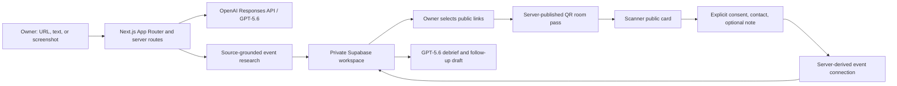

# NameTags: Complete Product Context for Brand and Video Ideation

## Use this brief

Use this document as the source of truth when creating brand directions, a launch film, a Build Week submission video, social clips, a pitch deck, or marketing copy for **NameTags**. Describe only the product that exists today. Do not turn it into a generic AI assistant, a full CRM, an attendee directory, a dating app, a LinkedIn clone, or an automatic outreach tool.

The canonical product line is:

> **Networking, without the pressure.**

The core product claim is:

> **NameTags turns event anxiety into one real next step.**

## Product in one paragraph

NameTags is a private, attendee-owned event copilot for people who feel rushed before an event, uncertain during it, or overwhelmed by follow-up afterward. A person pastes an event URL, rough description, event name/date, or screenshot. NameTags researches and explains the room, supports a short follow-up conversation, helps the owner choose the few links that belong on one event-specific QR pass, and lets a scanner voluntarily share their own contact details and a note. After the event, the same event context powers a private follow-up queue with editable AI drafts and a visible `to send -> sent -> done` workflow.

NameTags is not fundamentally a QR business card. The QR is the simplest in-room handoff inside a complete before, during, and after event loop.

## The human problem

Networking tends to fail in three emotionally distinct moments:

1. **Before the event:** "I am on the train, subway, or in an Uber. I do not know what this event is really about, who I should listen to, or what I could ask."
2. **During the event:** "I do not want to awkwardly explain five different links or give everyone the wrong thing."
3. **After the event:** "I have names, business cards, half-remembered conversations, and no energy to figure out who to follow up with."

NameTags reduces cognitive load at exactly those moments. It does not promise to make someone charismatic or socially perfect. It helps them understand the room, share one clean surface, and preserve the next action.

## Target user

The first audience is a person entering a high-density networking situation for the first time or under time pressure:

- Students at career fairs, startup events, and seminars.
- Hackathon, Build Week, and demo-day participants.
- First-time founder meetup attendees.
- Conference attendees who need a fast, grounded event brief.
- Early-career builders, founders, community members, and curious learners.

The user is not necessarily introverted. The common trait is that networking feels cognitively expensive: they do not have enough time to research, choose what to share, remember context, or write follow-ups well.

## The central promise

> **Understand the room, make one good connection, and remember the next step.**

The product should feel calm, direct, practical, and non-performative. It should never make the user feel like they need to become a salesperson, influencer, or overly polished "networker."

## End-to-end user journey

```text
Before
Event URL / event name / description / screenshot
  -> grounded event research
  -> conversational follow-up questions
  -> one clear personal outcome

During
Private link vault
  -> event-specific public link selection
  -> high-contrast QR room pass
  -> scanner saves public card or explicitly opts in to share back

After
Connection + event + optional note + promise
  -> private follow-up queue
  -> AI priority and editable draft
  -> to send -> sent -> done
```

The event is the continuity layer. The same event ID connects the original source, research, questions, QR pass, scanner connection, private notes, and follow-up. This continuity is the core technical and product proof.

## Product surfaces and implemented features

### 1. Account and private workspace

NameTags has an account-first private workspace. A user can enter with Google OAuth, email/password, or email magic link when those providers are configured. The app also has a no-login fictional sample event for fast reviewer onboarding.

The signed-in workspace stores:

- Profile name, headline, optional public bio, school, organization, role, interests, and optional private context.
- A reusable link vault.
- Events and their research context.
- Event-specific cards and public link choices.
- Private notes, contacts, public-contact research, and follow-up status.

The profile context is used to tailor private research and advice. It is never copied into the public QR card.

### 2. Event research: Subway Mode

The owner can begin from:

- A public event URL.
- A short natural-language search such as an event name and date.
- A rough description typed in their own words.
- A flyer, event-post, or poster screenshot.

NameTags uses the OpenAI Responses API and web search where appropriate to create a compact, source-grounded event read. It is designed for fast understanding rather than a long research report.

The generated private brief can include:

- What the event is and why it matters for the user's selected outcome.
- Key topics supported by the source.
- Confirmed speakers, organizers, or guests only when a source actually names them.
- Useful roles or attendee archetypes to meet when no named attendee list exists.
- What to notice in the room.
- Concrete questions to ask.
- Conversation starters.
- A lightweight recommended approach.
- Optional private introduction and short pitch guidance.
- A recommendation for which links to show or hide for this room.

NameTags intentionally makes missing information visible. It does not invent speakers, attendees, organizations, agendas, or relationships when an event page is thin or unclear.

### 3. Interactive research chat

The research brief has a conversational follow-up layer. The user can ask questions such as:

- "What is this event actually about?"
- "Who should I listen for?"
- "What is one smart question I could ask?"
- "How should I introduce myself here?"
- "What matters for my goal?"

The experience is intentionally compact. It offers starter questions and suggested next questions rather than dumping a long AI essay. Factual event questions can refresh public web research. Personal rehearsal uses the user's private profile only after the public research step, so personal information is not sent into web search.

Time-sensitive research, image reading, chat, and QR-card preparation use medium reasoning by default. The UI shows meaningful progress cues such as reading the event material, aligning it with the user's goal, and preparing practical next moves. This is not decorative "AI thinking" theater; it makes the wait legible.

### 4. Identity Vault and link management

The owner adds links once in Settings, then reuses them across events. Supported link types include LinkedIn, GitHub, portfolio, resume, website, email, demo, Devpost, calendar, Instagram, LINE, YouTube, TikTok, and custom links.

Each link can have:

- A URL that is normalized and format-validated.
- An optional custom label.
- An optional description explaining why it matters.
- A sensitivity setting, allowing personal links to be private by default.

NameTags does not claim to verify ownership of social accounts in this version. It is a user-controlled identity vault, not a social integration platform.

### 5. Event-specific public card decisions

For each event, GPT-5.6 recommends which stored links should be shown or hidden. The owner sees the rationale privately and can override every recommendation. The value is not that AI controls a person's identity; it is that the owner gets a fast, explainable starting point while they are under time pressure.

The owner can:

- Toggle each link between shown and hidden.
- Select a primary link.
- See why a link was suggested or hidden.
- Preview the public scanner view before publishing.
- Edit their owner-written public headline and bio separately from private research context.

### 6. QR Room Pass

Once the owner is ready, NameTags publishes a small public card and produces one QR code for that event. The QR share surface is intentionally bold, clear, and physical-feeling: a warm pale-orange room pass with the person's name, event name, a large readable dark QR code, and simple scan-to-open language.

The QR pass is event-specific. It is not a generic permanent profile page.

### 7. Public scanner card

The scanner lands on a screenshot-friendly, mobile-first public card. It is link-first and intentionally free of owner dashboard material or AI-generated social copy.

The public card may show:

- Owner name.
- Owner-written headline and optional bio.
- Event name.
- Only the links selected for this event.

The scanner can:

- Open the primary or additional public links.
- Save or share the card link.
- Download a card image.
- Use an in-app browser prompt to copy/open the card in Safari or Chrome when possible.
- Decide whether to share their own contact details back.

The scanner never sees hidden links, AI link rationale, private profile context, event research, private notes, other scanner contacts, or the follow-up queue.

### 8. Explicit connection capture

The QR experience has two separate actions:

1. Save the owner's public card without any obligation.
2. Deliberately share back a name, contact route, and optional conversation note.

Sharing back requires an explicit consent checkbox. The server records a consent timestamp. The scanner can choose not to exchange anything and still receive value from the card.

This is important: NameTags does not automatically identify a scanner, scrape their contact information, or create a connection just because someone opened a QR code.

### 9. Event debrief and follow-up

After the event, the owner sees a private follow-up workspace organized by event. They can review incoming scanner connections, add people from business cards or memory, write private notes, record promises, and rank priority.

For each contact, NameTags can provide:

- Why the connection is worth following up on.
- The conversation note and promise, when available.
- Suggested timing: today, within 48 hours, or this week.
- An editable first-person follow-up draft.
- A status flow: `to send -> sent -> done`.
- Copy and open actions for using the message in another channel.

Follow-up drafts are never sent automatically. The owner must review, edit, copy, and explicitly mark a message sent or done.

### 10. Optional public context for a contact

The owner can explicitly ask NameTags to check a single important contact's professional public context using a supplied name and optional public-profile URL. The system avoids searching private notes, email addresses, phone numbers, or sensitive information. It only uses a result when the identity is confidently confirmed and it can show visible public sources. Ambiguous matches do not influence an AI follow-up draft.

### 11. Sample event for reviewers

The product includes a clearly labeled fictional Founder Meetup demo that opens without account creation. It is in-memory, clean on every walkthrough, and contains no shared account or real user data. It exists so a reviewer can understand the entire product loop in under a minute.

## Information architecture

### Owner application

- **Events:** Event home with current, upcoming, recent, and past rooms.
- **Research:** Event brief, sources, speaker facts, questions, and interactive research chat.
- **Links:** Event-specific link selection and private owner rationale.
- **QR:** Public room pass and sharing surface.
- **Follow up:** Connections, notes, promises, draft messages, priority, and completion state.
- **Settings:** Profile, optional public bio, private tailoring context, and reusable links.

The mobile application uses a persistent bottom navigation for true destinations. The event journey is a visible sequence inside a room: Research -> Links -> QR -> Follow up.

### Public scanner application

- Public link card.
- Save/share/download actions.
- Optional consent-based connection form.
- No private dashboard information.

## Privacy and trust model

NameTags has two explicit trust zones.

1. **Private owner workspace:** profile, private context, research, hidden links, notes, connections, and follow-up queue.
2. **Public room pass:** only the selected link projection needed by a scanner.

The public payload intentionally excludes hidden links, link rationale, research prompts, research answers, private notes, contact records, persona guidance, and private profile fields.

Connections are protected by several rules:

- The scanner must actively consent.
- The server derives the target event from the published card rather than trusting a browser-supplied event ID.
- The public card GET endpoint never returns connections.
- The owner contact sync route is protected with a per-card owner sync key.
- Public contact submission includes input bounds, a honeypot field, and rate-limit guardrails.

## Technical architecture



### Stack

- **Frontend:** Next.js App Router, React, TypeScript, Tailwind CSS.
- **Design system:** Space Grotesk geometric sans plus IBM Plex Mono for ticket/pass metadata.
- **QR rendering:** `qrcode.react`.
- **Public-card image download:** `html-to-image`.
- **Authentication and owner data:** Supabase Auth, Supabase Postgres, browser client, Row Level Security.
- **AI:** OpenAI Responses API with GPT-5.6, structured JSON outputs, optional web search, and image input for event screenshots.
- **Deployment:** Vercel.
- **Fallbacks:** Deterministic source-aware mock data when an AI provider or event fetch is unavailable.

### Core data shape

- `auth.users`: Supabase identity.
- `user_workspaces`: One private JSON workspace per user, protected by RLS so only `auth.uid() = user_id` can read or write it.
- `cards`: Server-side public-card records.
- `contacts`: Server-side scanner connections linked to the public card.

The workspace includes profile, links, events, cards, notes, contacts, and follow-up state. The public card is intentionally a narrow projection with only ID, event ID, owner name, optional public headline/bio, event name, and selected public links.

### Key API routes

- `POST /api/brief`: public event URL/name/date lookup and source-grounded event research.
- `POST /api/event-image`: safe, bounded event screenshot reading.
- `POST /api/generate`: structured prep brief, private link recommendation, and QR-card preparation.
- `POST /api/research-chat`: context-aware research and networking questions, with optional fresh public research.
- `POST /api/contact-research`: owner-triggered public professional context check for one contact.
- `POST /api/debrief`: prioritization and editable follow-up drafts.
- `GET/POST/DELETE /api/public-card/[cardId]`: public card read, publish, and unpublish.
- `GET/POST /api/public-card/[cardId]/contacts`: owner sync and scanner consent capture.

## AI design principles

1. **Ground the event before advising.** Use event source text, saved research, or public search; never hallucinate a speaker list or attendee directory.
2. **Separate public fact gathering from private tailoring.** The web search layer should not receive the user's CV, LinkedIn About, notes, or private profile context.
3. **Use structured outputs.** Briefs, card decisions, research answers, contact checks, and follow-up drafts return bounded JSON shapes.
4. **Keep the user in control.** AI suggests questions, links, priority, and draft language. The owner edits public content and never auto-sends outreach.
5. **Match reasoning to the moment.** Fast research and in-room chat use medium reasoning. Multi-contact follow-up planning uses high reasoning.
6. **Fail gracefully.** If live research or AI fails, NameTags gives a clear fallback instead of blocking the workflow.

## What makes NameTags distinctive

Many adjacent tools exist: event listing pages, Linktree-style profiles, digital business cards, note apps, CRMs, and generic AI research tools. NameTags is different because it treats networking as one contextual event loop:

```text
Understand this room -> share the right public surface -> preserve this conversation -> take the next step.
```

The strongest differentiators are:

- Research is interactive and tied to one event rather than a generic profile assistant.
- The QR is a consented connection surface, not merely a static business card.
- The scanner can receive value without giving anything back.
- The same event context reaches the follow-up queue.
- Public and private identity are visibly separated.
- The product is designed for someone who is anxious, rushed, and not trying to become a networking expert.

## Product boundaries: do not claim these exist

- No automatic attendee matching or social graph.
- No automatic scanner identity detection.
- No automatic contact import from a QR scan.
- No automatic email, LinkedIn, SMS, or WhatsApp sending.
- No full CRM, team workspace, calendar sync, ticketing integration, payments, or native app.
- No claim that AI has searched a person's private social data.
- No claim that NameTags knows event attendees or speakers without source support.

## Current visual language

The product should feel like a confident event tool, not a generic soft-AI dashboard or a loud social app.

- **Typography:** Space Grotesk as the geometric primary sans; IBM Plex Mono for small ticket, pass, timestamp, and system metadata.
- **Core colors:** ink navy `#182235`, cobalt `#315DD3`, coral `#E86D50`, mint `#168779`, white paper, and pale blue-gray wash `#F2F5F8`.
- **QR room pass:** warm pale-orange / peach card with a dark brown QR code and ticket-like details.
- **UI character:** clean editorial spacing, compact information density, tickets/passes, thin dividers, simple rounded corners, clear state labels, no huge gradients, no decorative blobs, and minimal card nesting.
- **Emotion:** composure, readiness, privacy, momentum, and relief.

The experience can reference the clarity of a well-designed event ticket or boarding pass: it tells you what matters next without demanding attention.

## Brand territory to explore

The brand should make the product feel like a calm companion at the threshold of a room. It should not look like:

- A corporate CRM.
- A generic purple AI chatbot.
- A flashy conference organizer product.
- A personal-brand influencer tool.
- A dating or social discovery app.

Useful conceptual territories include:

- **The room pass:** a pass that makes an unfamiliar room feel legible.
- **The calm signal:** a small, confident cue that says "you have a next move."
- **The connective thread:** one event context survives from research to QR to follow-up.
- **The pocket event copilot:** something useful on a subway platform, in a lobby, or after leaving a crowded venue.
- **The humane handoff:** exchanging information without pressure or loss of control.

## What a brand model should generate

Create three clearly different brand directions. For each direction, include:

- Brand idea and emotional promise.
- One-line positioning and supporting message.
- Voice principles and example microcopy.
- Visual references described in words, not copied brand assets.
- Logo or wordmark behavior.
- Color and type recommendation that respects the existing ink/coral/cobalt/mint direction or explains a compelling evolution.
- QR room-pass treatment.
- Landing-page visual concept.
- Social thumbnail and poster concept.
- Why the direction fits a person who finds networking high-pressure.

Do not replace the product line "Networking, without the pressure" unless proposing a clearly stronger alternative and explaining why.

## What a video model should generate

Create a 2:30 to 3:00 minute Build Week demo film with real product screens as the hero. The story must prove the full loop, not just describe it.

Required narrative beats:

1. **0:00-0:15, emotional hook:** A person is on the way to an unfamiliar event. They are not unprepared because they are lazy; they simply do not have time to understand the room.
2. **0:15-0:45, research:** They paste an invite, event name/date, or screenshot. NameTags turns it into a short grounded read with sources and useful questions.
3. **0:45-1:05, interaction:** They ask the research chat a concrete follow-up question and receive a practical, tailored next move.
4. **1:05-1:25, privacy and choice:** They see their link vault, review why a few links fit this room, and choose what becomes public.
5. **1:25-1:55, QR moment:** The orange room pass appears. A second phone scans the QR and lands on the clean, link-first public card.
6. **1:55-2:20, consented connection:** The scanner saves the card, then deliberately chooses to share a name, a contact route, and a small note. Emphasize that sharing back is optional.
7. **2:20-2:42, follow-up:** Back in the owner workspace, the connection is attached to the same event. AI turns the note into an editable, human-sounding follow-up. The owner marks it sent and done.
8. **2:42-3:00, proof and close:** Show the event context path and close with "Networking, without the pressure." Mention that GPT-5.6 powers grounded research and follow-up, while Codex helped build and iterate the full flow.

The video should avoid generic stock footage of handshakes, fake dashboards, exaggerated "AI magic," or claims of automatic social success. It should feel observed, grounded, mobile-native, and emotionally accurate.

## Copy-paste prompt for a brand and video ideation model

```text
You are a world-class brand strategist, product marketer, and creative director. I need you to create a cohesive brand platform and Build Week demo-video direction for the following real product.

PRODUCT: NameTags
TAGLINE: Networking, without the pressure.
CORE CLAIM: NameTags turns event anxiety into one real next step.

NameTags is a private, attendee-owned event copilot for people who feel rushed before an event, awkward during it, or overwhelmed by follow-up afterward. A user pastes an event URL, rough description, short event name/date, or event screenshot. The product creates a source-grounded event brief, lets the user ask contextual questions, helps them choose a few event-specific public links, creates one QR room pass, lets a scanner optionally and explicitly share their own contact plus a conversation note, and turns the resulting event context into a human-reviewed follow-up queue.

The key product loop is:
event source -> grounded research -> owner-selected public links -> QR connection -> event-specific follow-up.

The product is mobile-first. The owner has a private workspace. The scanner sees only a clean, link-first public card. The scanner can save the card without sharing anything back. If they choose to connect, they must consent. Private notes, hidden links, AI reasoning, research, and follow-up never appear in the public card. AI never auto-sends messages.

AUDIENCE: students at career fairs and startup events, hackathon and demo-day participants, first-time founder meetup attendees, and conference attendees who find networking cognitively expensive. The product is for people who want to feel prepared and human, not like polished salespeople.

EXISTING VISUAL LANGUAGE: Space Grotesk geometric sans, IBM Plex Mono for metadata, ink navy (#182235), cobalt (#315DD3), coral (#E86D50), mint (#168779), white paper, pale blue-gray wash. The QR share object is a warm pale-orange ticket-like room pass with a dark QR. The interface is compact, editorial, mobile-first, calm, and clear. Avoid generic purple AI gradients, decorative blobs, CRM aesthetics, influencer aesthetics, and dating-app energy.

WHAT MAKES IT DISTINCTIVE:
- Research is a conversation about one room, not a generic AI summary.
- The QR is a consented connection surface, not just a static business card.
- The same event context survives through research, connection, and follow-up.
- The product protects private context while making public sharing simple.
- The emotional job is reducing networking pressure, not maximizing leads.

DO NOT CLAIM: automatic attendee matching, identity detection from a QR scan, a social graph, automatic messaging, full CRM features, social-account verification, calendar sync, or private-person web scraping.

Please deliver:
1. A sharp positioning statement and brand narrative.
2. Three distinct brand territories, each with a name, emotional promise, visual system, voice, logo/wordmark behavior, campaign line, landing-page concept, QR-pass treatment, and why it fits this user.
3. A recommendation for the strongest territory and how it can evolve from the existing navy/coral/cobalt/mint system.
4. A complete 2:30-3:00 Build Week video concept with time-coded scenes, on-screen product moments, voiceover, transition ideas, sound/motion direction, and a final closing frame.
5. Five short social-video hooks and five concise product messages.
6. A list of visual or verbal traps to avoid so the brand does not become generic AI, generic networking, or a QR business-card clone.

Make the work emotionally intelligent, specific, and cinematic without exaggerating what the product does. The product screens and the real user journey must remain the hero.
```
