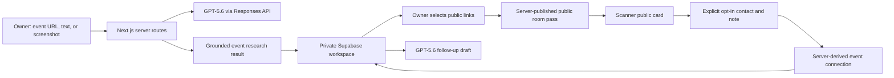

# NameTag Architecture Overview

## System Shape

NameTag is a Next.js application with two distinct trust zones:

1. **Owner workspace:** authenticated, private, and synchronized through Supabase Auth plus Row Level Security.
2. **Public room pass:** a deliberately small server-published projection used by the QR scanner.



## Client And Server Responsibilities

| Area | Implementation | Responsibility |
| --- | --- | --- |
| UI | Next.js App Router, React, Tailwind | Mobile-first owner workspace and scanner card |
| QR | `qrcode.react` | Renders opaque public card URL |
| Workspace auth/sync | Supabase Auth + browser client | Email/password, magic link, optional Google OAuth, owner-only workspace state |
| Public QR data | Next.js server routes + Supabase | Publishes and reads the small public card projection |
| Scanner connection | Server route + Supabase | Validates consent, derives the event ID, stores connection safely |
| AI | OpenAI Responses API | Event prep, research chat, link recommendation, debrief and draft follow-up |
| Fallbacks | `lib/mock-ai.ts` | Keeps the flow usable without a model key or after a temporary provider failure |

## Data Boundaries

### Private owner state

The `public.user_workspaces` Supabase table holds a JSON workspace per `auth.users` ID. It contains profile fields, private tailoring context, links, events, internal cards, notes, contacts, and follow-up state. RLS permits only `auth.uid() = user_id` to read or write it.

Private context may tailor AI output, but it is never included in the public card payload.

### Public room pass

`PublicCard` is a narrow projection:

```ts
{
  id,
  eventId,
  ownerName,
  headline?,
  bio?,
  eventName?,
  links: [{ label, type, url }],
  createdAt
}
```

It intentionally excludes hidden links, rationale, research, private notes, contact records, prompt inputs, persona text, CTA text, and owner workspace data.

### Connection record

The scanner submits a name, a preferred contact route, optional note, and `consent: true`. The browser-provided event ID is not trusted. `app/api/public-card/[cardId]/contacts` loads the published card and derives the target event ID server-side before storage.

The scanner-facing GET endpoint never returns contacts. The owner uses a per-card sync key, checked server-side, to poll for their own incoming connections.

## Route Map

| Route | Purpose | Safety behavior |
| --- | --- | --- |
| `POST /api/brief` | Reads public event metadata/text | URL validation, bounded fetch, thin-content rejection |
| `POST /api/event-image` | Processes event screenshot input | Bounded image input and model fallback |
| `POST /api/generate` | Structured event brief and link recommendation | Strict JSON, grounded system instructions, deterministic fallback |
| `POST /api/research-chat` | Context-aware follow-up questions | Bounded input and source context |
| `POST /api/debrief` | Priority and follow-up draft | Editable output and deterministic fallback |
| `GET/POST /api/public-card/[cardId]` | Read/publish public room pass | Public payload validation, owner sync key for publish |
| `GET/POST /api/public-card/[cardId]/contacts` | Owner sync / scanner opt-in | Explicit consent, honeypot, text bounds, rate-limit guard, server-derived event ID |

## Failure Behavior

- **No `OPENAI_API_KEY` or API unavailable:** deterministic, source-aware fallback keeps the event flow usable.
- **Thin SPA event page:** NameTag does not invent detail; it asks for pasted text or a screenshot.
- **No server-side Supabase secret:** public QR/contact persistence falls back only for local development and is not suitable for deployment.
- **Google provider not enabled:** the application shows a clear account error and offers email/password, magic-link, or sample-event routes. Provider enablement remains an external Supabase/Google Cloud configuration task.

## Required Environment Variables

```bash
OPENAI_API_KEY=
OPENAI_MODEL=gpt-5.6-terra

SUPABASE_URL=https://YOUR_PROJECT_REF.supabase.co
SUPABASE_SECRET_KEY=sb_secret_...

NEXT_PUBLIC_SUPABASE_URL=https://YOUR_PROJECT_REF.supabase.co
NEXT_PUBLIC_SUPABASE_PUBLISHABLE_KEY=sb_publishable_...
```

Only the `NEXT_PUBLIC_*` values are browser-visible. The secret key must remain server-only in `.env.local` and the hosting provider's server environment.

## Operational Checklist

1. Apply [`supabase/schema.sql`](../supabase/schema.sql) in the Supabase SQL editor.
2. Configure Vercel server variables and deploy.
3. Enable the desired Supabase Auth providers. Google also requires a Google Cloud Web OAuth client with Supabase's callback URL.
4. Create an event, open QR once so the public projection publishes, and test on a second device.
5. Verify the second-device scanner sees only public links; submit a consented connection; verify it reaches the matching owner event queue.

## Production Work Beyond Build Week

The prototype is deliberately not described as a production security program. A production launch needs shared rate limiting, audit logging, anti-abuse controls, data-export/deletion workflows, encryption strategy for private context, monitoring, real error reporting, and consent retention policies.
